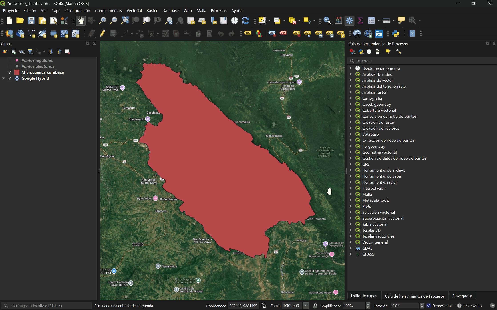
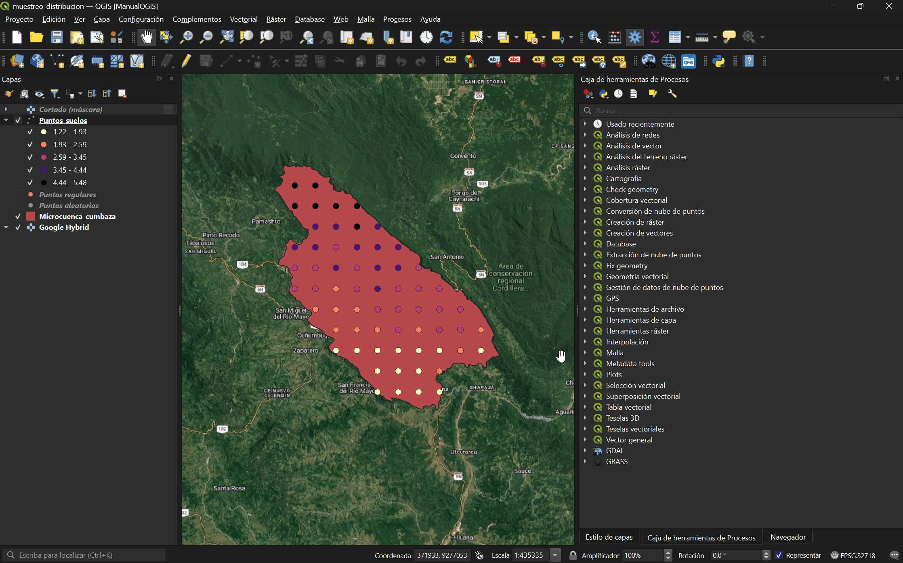

# Muestreo y su distribución espacial {#sec-practica1}

::: {.callout-note appearance="simple"}
**Curso:** Sistema de Información Geográfica (0101140064) · Escuela Profesional de Agronomía · UNSM-T
**Unidad III · Semana 13** — Diseño de mapas con puntos de muestreo con fines de investigación.
**Software:** QGIS 4.2 "Belém do Pará" (Qt6). Los pasos son válidos también en QGIS 3.44 LTR; las rutas de menú son prácticamente idénticas.
:::

## Introducción

El muestreo es la base de toda investigación agronómica de campo: define *dónde* medimos y determina qué tan bien nuestras observaciones representan al conjunto de la parcela. Cuando a cada muestra le asociamos una coordenada, dejamos de tener una simple tabla y pasamos a tener un **patrón espacial** que podemos analizar: ¿las plantas afectadas se agrupan en un foco?, ¿la fertilidad se distribuye al azar?, ¿existe un gradiente?

En esta práctica diseñaremos una red de muestreo sobre una parcela, capturaremos los datos en campo, y analizaremos su distribución espacial en QGIS. En cada paso se incluye además el **equivalente en R**, para que la misma práctica pueda reproducirse por código.

### Objetivos

- Diseñar redes de muestreo (sistemática y aleatoria) sobre un área de estudio.
- Analizar el patrón espacial mediante mapas de calor, vecino más cercano e interpolación.
- Elaborar un mapa temático final con los puntos de muestreo.

### Materiales y requisitos

| Recurso | Detalle |
|---|---|
| Software | QGIS 4.2 (o 3.44 LTR) |
| Datos base | Límite del área de estudio (`.gpkg` / `.shp`) |
| SRC de trabajo | WGS 84 / UTM zona 18S (EPSG:32718) |
| Opcional (versión R) | R ≥ 4.3 con `sf`, `terra`, `spatstat`, `gstat`, `tmap`, `dplyr` |

---

## Preparación del proyecto {#sec-preparacion}

1. Abre QGIS 4.2 y crea un proyecto nuevo: **Proyecto ▸ Nuevo ▸ Guardar**.
2. Define el SRC del proyecto: barra inferior derecha (icono del globo) ▸ escribe **32718** ▸ selecciona *WGS 84 / UTM zone 18S*.
3. Carga el límite del área de estudio: **Panel Navegador ▸ Inicio del proyecto** y doble click en el archivo.
4. Verifica que la capa cae sobre la ubicación correcta añadiendo un mapa base (plugin **NextGIS QuickMapServices** o el conector XYZ de OpenStreetMap).

{#fig-m1-proyecto width=95%}

::: {.callout-tip collapse="true"}
## 🔵 Equivalente en R

```{r}
#| label: r-setup-m1
#install.packages(c("sf","terra","spatstat","gstat","tmap","dplyr","units",
                   "exactextractr","tidyterra"))

install.packages(c("sf","terra","spatstat","gstat","dplyr", "mapsf"))

library(sf)         # datos vectoriales: leer shapefiles, reproyectar, muestreo
library(terra)      # datos ráster: crear, recortar, rasterizar superficies
library(spatstat)   # análisis de patrones de puntos: densidad, Smooth, vecino más cercano
library(gstat)      # interpolación espacial (IDW / kriging)
library(dplyr)      # manipulación de tablas: unir datos, clasificar, crear campos
library(mapsf)      # diseño de mapas temáticos (contorno, escala, norte, leyenda)


# Área de estudio (ajusta la ruta a tu archivo)
area <- st_read("muestreo_distribucion/Shapefile/Microcuenca_cumbaza.shp")

# Reproyectar a UTM 18S para trabajar en metros
area <- st_transform(area, 32718)

# Mapa del contorno con mapsf
mf_map(st_geometry(area), col = "grey90", border = "grey20", lwd = 2)
mf_title("Microcuenca del Cumbaza")
mf_scale(pos = "bottomright")
mf_arrow(pos = "topleft")
mf_credits("WGS 84 / UTM 18S · Elaboración propia")
```
:::

---

## Diseño de la red de muestreo {#sec-diseno}

QGIS ofrece varios algoritmos según el tipo de muestreo. Los encuentras en **Procesos ▸ Caja de herramientas** (o `Ctrl+Alt+T`).

### Muestreo sistemático (malla regular)

Útil para caracterizar variabilidad continua (fertilidad, humedad, vigor).

1. Caja de herramientas ▸ **Creación de vectores ▸ Puntos regulares**.
2. En *Extensión de entrada* selecciona el área de estudio (icono ▸ *Usar extensión de capa*).
3. Define el *Espaciado de puntos* (ej. 3000 m) según la resolución que necesites.
4. Ejecuta y recorta al polígono con **Superposición vectorial ▸ Cortar** si la malla excede el borde.

{#fig-m1-malla width=95%}

### Muestreo aleatorio

Requerido cuando el diseño estadístico exige independencia entre muestras.

1. Caja de herramientas ▸ **Creación de vectores ▸ Puntos aleatorios dentro de polígonos**.
2. Capa de entrada: el área de estudio.
3. Estrategia: *Número de puntos* (ej. 40) y una *distancia mínima* (ej. 2500 m) entre puntos para evitar agrupamientos.
4. Ejecuta.

{#fig-m1-aleatorio width=95%}

::: {.callout-note}
Para **muestreo estratificado** (por unidades de manejo, tipos de suelo o campañas), primero divide el área en estratos y genera puntos por polígono usando el mismo algoritmo con la capa de estratos como entrada.
:::

::: {.callout-tip collapse="true"}
## 🔵 Equivalente en R

```{r}
#| label: r-diseno-m1

library(spatstat.random)

## --- Generar ambos muestreos ---
malla <- st_make_grid(area, cellsize = 3000, what = "centers") |>
  st_as_sf() |>
  st_filter(area)

win <- as.owin(st_geometry(area))
set.seed(2026)
ssi <- rSSI(r = 2500, n = 40, win = win)
aleatorio <- st_as_sf(data.frame(x = ssi$x, y = ssi$y),
                      coords = c("x", "y"), crs = st_crs(area))

## --- Dos paneles lado a lado ---
par(mfrow = c(1, 2))

# Panel 1: sistemático
mf_map(st_geometry(area), col = "grey95", border = "grey40", lwd = 1.5)
mf_map(malla, pch = 2, col = "#2166ac", cex = 1, lwd = 2, add = TRUE)
mf_title("Sistemático (malla 3000 m)")
mf_scale(pos = "bottomleft")
mf_arrow(pos = "topleft")

# Panel 2: aleatorio inhibido
mf_map(st_geometry(area), col = "grey95", border = "grey40", lwd = 1.5)
mf_map(aleatorio, pch = 21, col = "grey20", bg = "#d6604d", cex = 0.9, add = TRUE)
mf_title("Aleatorio inhibido (2500 m)")
mf_scale(pos = "bottomleft")
mf_arrow(pos = "topleft")

par(mfrow = c(1, 1))   # restaurar el dispositivo
```
:::

---

## Análisis de la distribución espacial {#sec-analisis}

### Simbología graduada (magnitud por punto)

1. Añadir la capa **Puntos_suelos** desde el panel navegador.
2. Doble clic en la capa ▸ **Simbología**.
3. Cambia de *Símbolo único* a **Graduado**.
4. Valor: `variable`; método: *Rupturas naturales (Jenks)*; 5 clases; rampa de color a elección.
5. Clasifica y aplica.

{#fig-m1-graduado width=95%}

### Mapa de calor (densidad kernel)

Muestra dónde se concentran las observaciones (o la magnitud, si se pondera).

1. Caja de herramientas ▸ **Análisis de mapa de calor ▸ Mapa de calor (estimación de densidad kernel)**.
2. Capa de puntos: tu capa de campo.
3. *Radio* según la escala del fenómeno (ej. 50 m); opcionalmente pondera con el campo `variable`.
4. Ejecuta y aplica una rampa de color pseudocolor al ráster resultante.

{#fig-m1-heatmap width=95%}

### Análisis del vecino más cercano

Cuantifica si el patrón es **agrupado, aleatorio o disperso** mediante el índice R de Clark y Evans [@clark1954].

1. Caja de herramientas ▸ **Análisis vectorial ▸ Análisis del vecino más cercano**.
2. Capa de entrada: los puntos de muestreo.
3. Ejecuta: el resultado (HTML) reporta el **índice del vecino más cercano**:
   - R < 1 → patrón **agrupado**
   - R ≈ 1 → patrón **aleatorio**
   - R > 1 → patrón **disperso/regular**

El valor de R = 1.67 por lo tanto el patron es **disperso/regular**.

{#fig-m1-vecino width=95%}

::: {.callout-tip collapse="true"}
## 🔵 Equivalente en R

```{r}
#| label: r-patron-m1

pts <- st_read("muestreo_distribucion/Shapefile/Puntos_suelos.shp")

## 1. Patrón de puntos MARCADO con la MO ----
win <- as.owin(st_union(st_geometry(area)))
xy  <- st_coordinates(pts)
P   <- ppp(xy[, 1], xy[, 2], window = win, marks = pts$MO)
stopifnot(npoints(P) == nrow(pts))

## 2. Suavizado kernel de la MO -> valores en %, no densidad ----
sigma_opt <- bw.smoothppp(P)              # ancho de banda propio de Smooth (no bw.diggle)
mo_s <- Smooth(P, sigma = sigma_opt)      # media local ponderada de MO

## 3. Convertir 'im' a SpatRaster ----
mo_r <- rast(as.data.frame(mo_s), type = "xyz")   # columnas x, y, value (= MO %)
crs(mo_r) <- st_crs(area)$wkt
mo_r <- mask(mo_r, vect(area))
names(mo_r) <- "MO (%)"

## 4. Mapa con mapsf ----
mf_raster(mo_r, type = "continuous", pal = "Inferno", rev = F,
          leg_pos = "topright", leg_title = "MO (%)")
mf_map(st_geometry(area), col = NA, border = "grey20", lwd = 1.2, add = TRUE)
mf_map(pts, pch = 21, col = "grey20", bg = "white", cex = 0.6, add = TRUE)
mf_scale(pos = "bottomright")
mf_arrow(pos = "topleft")
mf_title("Superficie suavizada de MO del suelo (%)")
mf_credits("Datos simulados · WGS 84 / UTM 18S")

#Analisis de vecino mas cercano

## 1. Patrón de puntos dentro del área (solo posiciones) ----
area_union <- st_union(st_geometry(area))
win <- as.owin(area_union)
xy  <- st_coordinates(pts)
P   <- ppp(xy[, 1], xy[, 2], window = win)
P   <- unmark(P)                 # el vecino más cercano analiza UBICACIONES, no la MO
stopifnot(npoints(P) > 0)

area_km2 <- as.numeric(st_area(area_union)) / 1e6   # (evita usar area() de spatstat: 'area' es tu capa)

## 2. Distancias al vecino más cercano ----
nn      <- nndist(P)                     # distancia de cada punto a su vecino más próximo
lambda  <- intensity(P)                  # densidad = nº puntos / área
r_esper <- 1 / (2 * sqrt(lambda))        # distancia media esperada bajo aleatoriedad (CSR)

## 3. Índice de Clark-Evans (R) + prueba de Monte Carlo ----
R_cdf <- clarkevans(P, correction = "cdf")     # estimador con corrección de borde (ventana irregular)
set.seed(2026)
ce <- clarkevans.test(P, correction = "none",  # prueba por simulación: el borde se cancela solo
                      alternative = "two.sided", nsim = 999)

## 4. Interpretación automática ----
patron <- if (ce$p.value >= 0.05) "ALEATORIO (no se rechaza CSR)" else
          if (R_cdf < 1)          "AGRUPADO (clustered)"          else
                                  "DISPERSO / REGULAR"

cat("=========== Vecino más cercano ===========\n")
cat("Puntos analizados      :", npoints(P), "en", round(area_km2, 2), "km²\n")
cat("Dist. media observada  :", round(mean(nn), 1), "m\n")
cat("Dist. media esperada   :", round(r_esper, 1), "m (bajo aleatoriedad CSR)\n")
cat("Índice R (Clark-Evans) :", round(R_cdf, 3), "\n")
cat("p-valor (999 sim.)     :", format.pval(ce$p.value, digits = 3), "\n")
cat("Patrón espacial        :", patron, "\n")
cat("==========================================\n")

## 5. Función G: distribución acumulada de distancias al vecino, con envolvente CSR ----
set.seed(2026)
G <- envelope(P, fun = Gest, nsim = 99, correction = "km")
plot(G, main = "Función G del vecino más cercano (envolvente CSR)",
     xlab = "Distancia r (m)", ylab = "G(r)", legend = FALSE)

```
:::

### Interpolación de la variable (IDW) y polígonos de Voronoi

Para pasar de puntos a una **superficie continua** estimada.

1. **IDW:** Caja de herramientas ▸ **Interpolación ▸ Interpolación IDW**. Selecciona la capa, el campo `variable`, el coeficiente de distancia (P=2) y la extensión del área. Ejecuta.
2. **Voronoi (alternativa por vecindad):** Caja de herramientas ▸ **Geometría vectorial ▸ Polígonos de Voronoi**; luego colorea cada polígono por el valor de su punto.

{#fig-m1-idw width=95%}

::: {.callout-tip collapse="true"}
## 🔵 Equivalente en R

```{r}
#| label: r-idw-m1

pts <- st_read("muestreo_distribucion/Shapefile/Puntos_suelos.shp")
#Interpolación IDW

## 1. Rejilla de predicción: ráster vacío sobre el área (celda 200 m) ----
grid_r <- rast(vect(area), resolution = 200)
values(grid_r) <- 1                       # valores dummy para extraer los centros
grid_pts <- as.points(grid_r) |> st_as_sf()   # centros de celda como locations

## 2. Interpolación IDW (potencia p = 2) ----
idw_res <- gstat::idw(MO ~ 1, locations = pts, newdata = grid_pts,
                      idp = 2, nmax = 12)   # nmax limita vecinos: más rápido y estable

## 3. Rasterizar la predicción y recortar al área ----
idw_r <- rasterize(vect(idw_res), grid_r, field = "var1.pred")
idw_r <- mask(idw_r, vect(area))
names(idw_r) <- "MO (%)"

range(values(idw_r), na.rm = TRUE)        # verifica que estén en % (~1.2–5.5)

## 4. Mapa con mapsf ----
mf_raster(idw_r, type = "continuous", pal = "YlGn",
          leg_pos = "topright", leg_title = "MO (%)")
mf_map(st_geometry(area), col = NA, border = "grey20", lwd = 1.2, add = TRUE)
mf_map(pts, pch = 21, col = "grey20", bg = "white", cex = 0.6, add = TRUE)
mf_scale(pos = "bottomright")
mf_arrow(pos = "topleft")
mf_title("Interpolación IDW de MO del suelo (%)")
mf_credits("Datos simulados · WGS 84 / UTM 18S")

#Poligonos de Voronoi

## 1. Cargar los puntos (con la MO) y el área ----
pts  <- st_read("muestreo_distribucion/Shapefile/Puntos_suelos_voronoi.shp") |> st_transform(32718)
area <- st_transform(area, 32718)          # asegura metros
stopifnot("MO" %in% names(pts))            # el shapefile debe traer el campo MO

## 2. Teselación de Voronoi ----
voro <- st_voronoi(st_union(pts))          # st_union -> MULTIPOINT de entrada
voro <- st_collection_extract(voro, "POLYGON")
voro <- st_sf(geometry = voro)

# ¡Clave! st_voronoi devuelve las celdas en orden arbitrario:
# hay que reasociar la MO a cada celda con una unión espacial.
voro <- st_join(voro, pts["MO"], join = st_intersects)

# Recortar las celdas al límite del área de estudio
voro <- st_intersection(voro, st_geometry(area))
voro <- st_collection_extract(voro, "POLYGON")   # por si el recorte deja bordes mixtos

## 3. Coropleta graduada por MO con Jenks (5 clases) ----
mf_map(x = voro, var = "MO", type = "choro",
       breaks = "jenks", nbreaks = 5,      # "jenks" = Rupturas naturales de QGIS
       pal = "Greens",
       border = "grey30", lwd = 0.4,
       leg_title = "MO (%)", leg_pos = "topright", leg_val_rnd = 2)
mf_map(pts, pch = 20, col = "grey20", cex = 0.5, add = TRUE)          # puntos
mf_map(st_geometry(area), col = NA, border = "grey10", lwd = 1.5, add = TRUE)
mf_title("Polígonos de Voronoi — MO del suelo (Jenks)")
mf_scale(pos = "bottomright")
mf_arrow(pos = "topleft")
mf_credits("Datos simulados · WGS 84 / UTM 18S")
```
:::

---

## Producto de la práctica

Entrega un mapa temático (PDF/JPEG) con:

- La red de muestreo y la variable simbolizada por magnitud.
- Al menos un análisis de patrón (mapa de calor o vecino más cercano) con su interpretación.
- Todos los elementos cartográficos (título, leyenda, escala, norte, grilla, membrete).

Y una breve interpretación (½ página): ¿el patrón es agrupado, aleatorio o disperso? ¿Qué implica para tu objeto de estudio?
